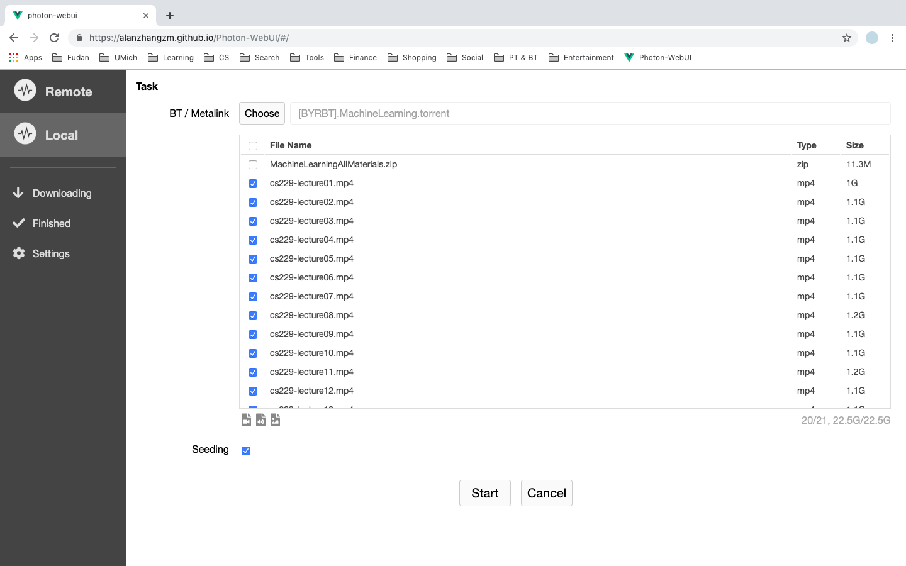

Languages: [English](https://github.com/alanzhangzm/Photon-WebUI) [中文](https://github.com/alanzhangzm/Photon-WebUI/blob/master/README.zh-CN.md)

# Photon WebUI

*Photon WebUI* is a modern frontend for [aria2](https://github.com/aria2/aria2).

For desktop downloader, please have a look at [*Photon*](https://github.com/alanzhangzm/Photon).


## Use

Visit https://github.com/zmzhang8/Photon-WebUI

## Feature

- Manage multiple aria2 servers
- BT: selective downloading


## Screenshots




## Development

``` bash
# install dependencies
npm install

# serve with hot reload at localhost:8080
npm run serve

# build for production with minification
npm run build
```

For a detailed explanation on how things work, check out the [guide](http://vuejs-templates.github.io/webpack/) and [docs for vue-loader](http://vuejs.github.io/vue-loader).


## License
[Apache-2.0](https://github.com/alanzhangzm/Photon-WebUI/blob/master/LICENSE)
