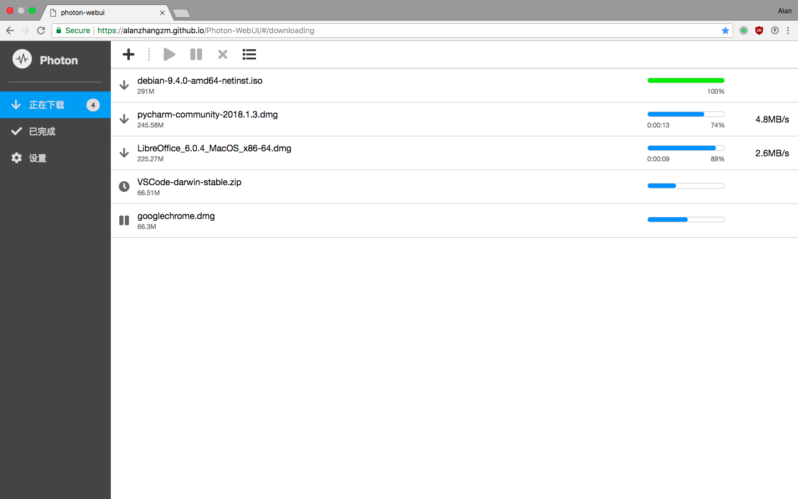
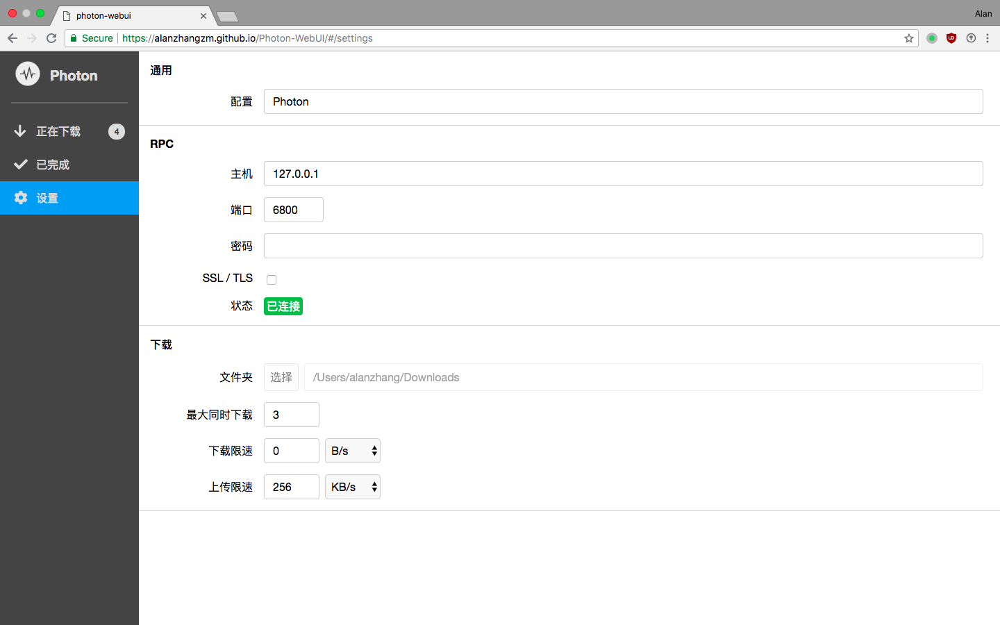
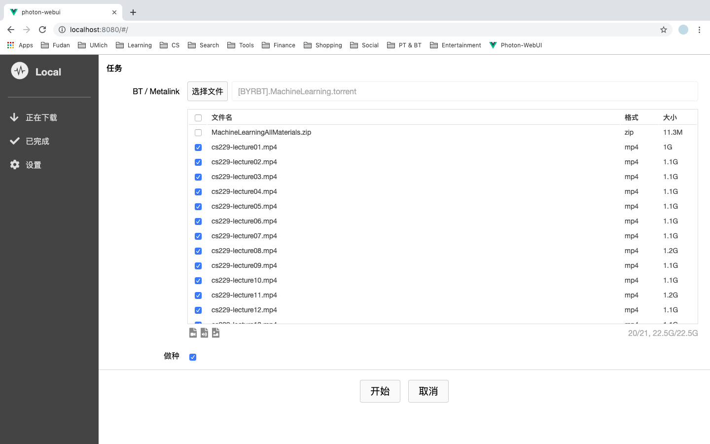

Languages: [English](https://github.com/alanzhangzm/Photon-WebUI) [中文](https://github.com/alanzhangzm/Photon-WebUI/blob/master/README.zh-CN.md)

# Photon WebUI

*Photon WebUI* 是一款管理 [aria2](https://github.com/aria2/aria2) 的网页前端。

如果你想要一个桌面下载器，请尝试 [*Photon*](https://github.com/alanzhangzm/Photon/blob/master/README.zh-CN.md)。

# 特色
- 管理多个 aria2 服务器
- BT：支持选择文件下载

## 使用

访问 https://github.com/zmzhang8/Photon-WebUI

## 截图

## 许可证
[Apache-2.0](https://github.com/alanzhangzm/Photon-WebUI/blob/master/LICENSE)
